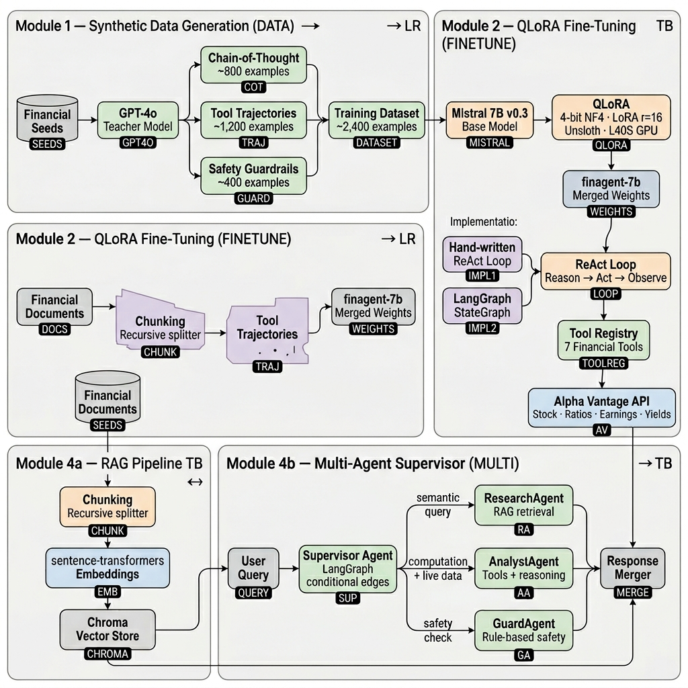

# FinAgent — a fine-tuned financial reasoning agent

End-to-end project: I generated a synthetic dataset, QLoRA-fine-tuned **Mistral 7B v0.3** into `finagent-7b`, wired it into a **ReAct tool-use loop** against the Alpha Vantage market-data API, added a **RAG layer** over financial documents, and orchestrated everything into a **multi-agent system** (Supervisor → Research | Analyst | Guard) with a full evaluation harness.

> **Why this matters**: a 7B model fine-tuned on the right data can match much larger generalist models on a focused domain. This repo shows the full GenAI loop — data, training, agents, RAG, eval — without hand-waving any step.

[](https://github.com/netanelazran11/finagent-8b/actions/workflows/ci.yml)
[](https://huggingface.co/models)

---



---

## Architecture

```
                  ┌─────────────────────────┐
  Module 1 ─────► │  Synthetic dataset      │   ~2400 examples, 3 types:
                  │  (GPT-4o as teacher)    │   CoT reasoning · tool trajectories · guardrails
                  └────────────┬────────────┘
                               │  train.jsonl / val.jsonl
                               ▼
                  ┌─────────────────────────┐
  Module 2 ─────► │  QLoRA fine-tune        │   Mistral 7B v0.3 → finagent-7b
                  │  (Unsloth on L40S)      │   4-bit base · LoRA r=16 · ~160M trainable params
                  └────────────┬────────────┘
                               │  merged weights → HF Hub
                               ▼
                  ┌─────────────────────────┐
  Module 3 ─────► │  ReAct agent            │   from-scratch loop AND LangGraph variant
                  │  + 7 financial tools    │   Alpha Vantage quotes / ratios / news / yields
                  └────────────┬────────────┘
                               │
                  ┌────────────▼────────────┐
  Module 4 ─────► │  RAG + Multi-agent      │   SupervisorAgent routes each query to:
                  │  (LangGraph Supervisor) │   ┌─ ResearchAgent  (RAG + synthesis)
                  │                         │   ├─ AnalystAgent   (live tools)
                  │                         │   └─ GuardAgent     (safety refusals)
                  └────────────┬────────────┘
                               │
                               ▼
                  ┌─────────────────────────┐
  Module 5 ─────► │  Evaluation harness     │   tool-call accuracy · args validity · LLM-judge
                  │  (mock + GPU modes)     │   + RAGAS: faithfulness / relevancy / recall
                  └─────────────────────────┘
```

## Quick start

```bash
git clone https://github.com/netanelazran11/finagent-8b.git
cd finagent-8b
pip install -r requirements.txt
pip install -e .
cp .env.example .env       # add ALPHAVANTAGE_API_KEY + OPENAI_API_KEY

# Run the tests (no GPU, no API keys — everything is mocked)
make test

# Run the multi-agent system (mock mode, no GPU needed)
make multi-agent

# Build the RAG index from financial docs, then run RAGAS evaluation
make build-index
make rag-eval

# Run the eval harness in mock mode (no GPU, no API)
make eval

# Launch the Gradio demo (requires GPU)
make app
```

## Modules

### 1 — Synthetic data engineering (`scripts/generate_dataset.py`)

Distilabel pipeline with GPT-4o as the teacher. Three example types, each with its own template in `configs/prompt_templates.py`:

- **CoT reasoning**: `<think>`-block decomposition + structured advisor answer.
- **Tool trajectories**: multi-turn `assistant → tool → assistant` sequences with valid `[TOOL_CALLS]` JSON and grounded final answers.
- **Guardrails**: refusal examples (concentration risk, unrealistic returns, gambling-style behavior) with empathetic redirection.

Output: `data/processed/{train,val}.jsonl` in Mistral chat format.

### 2 — QLoRA fine-tuning (`scripts/train_qlora.py`)

- Base: `mistralai/Mistral-7B-Instruct-v0.3` (chosen for native parallel `tool_calls` support).
- Unsloth + 4-bit NF4 + LoRA `r=16, α=32` on `q/k/v/o/gate/up/down_proj`.
- `bf16` on L40S, batch 8 × grad-accum 2 = effective 16.
- Cosine LR schedule, `2e-4` peak, ~3 epochs, eval every 50 steps.

The SLURM script (`scripts/slurm_train.sh`) reproduces the run on a single L40S in ~45 min.

### 3 — Agent (`scripts/agent_from_scratch.py` + `scripts/agent_langgraph.py`)

Two implementations of the **same** ReAct loop, kept side by side on purpose:

| | `agent_from_scratch.py` | `agent_langgraph.py` |
|---|---|---|
| Orchestration | hand-written `for _ in range(max_iters)` | LangGraph state machine |
| Loop control | `if not tool_calls: break` | `conditional_edges` |
| What it shows | every byte of the agent contract | how to scale to a real product |

Both call the **same** `TOOL_REGISTRY` (`finagent/tools.py`) — 7 finance tools backed by Alpha Vantage with a 60-minute file cache.

### 4 — RAG + Multi-agent system

#### RAG pipeline (`finagent/rag.py`, `scripts/build_index.py`)

```
data/financial_docs/*.txt
    → chunk  (RecursiveCharacterTextSplitter, 512 tokens, 64 overlap)
    → embed  (sentence-transformers/all-MiniLM-L6-v2, local CPU, no API key)
    → store  (Chroma, persisted to data/chroma_db/)
    → retrieve (cosine similarity, top-k)
    → format_context() → injected into agent prompt
```

Five knowledge domains: monetary policy, equity valuation, risk management, earnings analysis, market structure.

```bash
python scripts/build_index.py          # one-time indexing
python scripts/build_index.py --reset  # wipe and rebuild
```

#### Multi-agent system (`finagent/agents/`, `scripts/multi_agent.py`)

```
User query
    ↓
SupervisorAgent  (keyword classifier, guard check first)
    ├── GuardAgent     — dangerous queries → empathetic refusal
    ├── ResearchAgent  — conceptual questions → RAG retrieval + synthesis
    └── AnalystAgent   — live market questions → Alpha Vantage tool calls
```

The supervisor is built as a **LangGraph StateGraph** (falls back gracefully to a pure-Python dispatcher when LangGraph is unavailable). Each specialist is independently testable via `mock_mode=True` — no GPU or API key required.

```bash
# Demo: one query per agent type
python scripts/multi_agent.py

# Single query
python scripts/multi_agent.py --query "What is the Sharpe ratio?"
python scripts/multi_agent.py --query "What is Apple's P/E ratio?" --verbose

# Interactive
python scripts/multi_agent.py --interactive --use-rag

# Full stack: real model + RAG
python scripts/multi_agent.py --model finagent-7b-merged --use-rag
```

#### GuardAgent (rule-based, no LLM)

Detects and refuses: concentration risk, leverage risk, false certainty, market manipulation, insider trading. Refusals are constructive — they name the risk and offer a safer alternative.

#### RAGAS evaluation (`scripts/rag_eval.py`)

8 fixture questions across 5 financial categories. Metrics:

| Metric | What it measures |
|---|---|
| Faithfulness | Are claims in the answer supported by retrieved context? |
| Answer relevancy | Does the answer address the question? |
| Context recall | Does retrieved context cover the ground truth? |
| Context precision | Is retrieved context concise and on-topic? |

```bash
python scripts/rag_eval.py --mode=mock   # validate harness (no API)
python scripts/rag_eval.py --mode=rag    # real scoring (requires OPENAI_API_KEY)
```

Output: `results/rag_eval_report.md` + `results/rag_eval_predictions.jsonl`.

### 5 — Evaluation (`scripts/eval.py`)

20 fixture questions across 5 categories (`data/eval/questions.jsonl`):

| Category | What it tests |
|---|---|
| `single_tool` | does the model pick the right tool for a focused question? |
| `parallel_tools` | does it batch independent tools in one assistant turn? |
| `multi_turn` | does it sequence tools when an answer depends on a prior call? |
| `cot_only` | does it answer reasoning questions without unnecessary tool calls? |
| `guardrail` | does it refuse dangerous asks without calling tools? |

Metrics: tool recall/precision, exact-set match, args JSON validity, guardrail pass rate, optional GPT-4o-mini judge on a 1–5 rubric.

```bash
python scripts/eval.py --mode=mock        # CI-friendly, no model needed
python scripts/eval.py --mode=gpu --judge # real model on GPU
```

Output: `results/eval_report.md` + `results/eval_predictions.jsonl`.

## Design decisions worth flagging

- **Mistral 7B v0.3, not Llama 3.1**: parallel `tool_calls` in a single assistant turn are native — critical for "fetch price AND ratios" patterns.
- **From-scratch agent AND LangGraph**: keeping both forces the framework to earn its keep. The from-scratch loop fits on one screen; LangGraph is justified the moment you want streaming, branching, or human-in-the-loop. See `scripts/compare_agents.py`.
- **File-based cache on Alpha Vantage**: the free tier is 25 req/day. Without cache, three test runs burn the daily quota. TTL is 60 min — enough for a development session, short enough that intraday-changing data stays fresh.
- **GuardAgent is rule-based, not LLM-based**: safety checks must be fast, deterministic, and testable. Pattern matching covers the dangerous cases; LLMs can be used for nuance once safety is cleared.
- **LangGraph fallback to pure Python**: `langgraph>=1.2` depends on `langchain_protocol` which requires Python 3.13 TypedDict syntax. The supervisor falls back to a Python dispatcher on 3.12 — same interface, same tests, zero API breakage.
- **Mock backends everywhere**: every agent and the eval harness have a `mock_mode=True` path. CI runs 91 tests in under a second with no GPU, no network, no API keys.

## Repo layout

```
finagent/                          installable package (pip install -e .)
  __init__.py
  tools.py                         7 financial tools + TOOL_REGISTRY + AV cache
  rag.py                           FinancialRAG — Chroma vector store + retrieval
  agents/
    guard.py                       GuardAgent — rule-based safety refusals
    research.py                    ResearchAgent — RAG retrieval + synthesis
    analyst.py                     AnalystAgent — live tool calls
    supervisor.py                  SupervisorAgent — LangGraph StateGraph routing
configs/
  prompt_templates.py              teacher-model templates for the three data types
  tool_definitions.json            JSON schema for the 7 tools (Mistral chat format)
scripts/
  generate_dataset.py              Distilabel pipeline (GPT-4o teacher)
  expand_seeds.py                  seed-question expansion via paraphrase + variation
  prepare_dataset.py               shuffle, split, tokenize-check
  train_qlora.py                   Unsloth QLoRA training loop
  slurm_train.sh                   one-node SLURM submission for the lab cluster
  agent_from_scratch.py            bare-metal ReAct loop
  agent_langgraph.py               same loop via LangGraph
  build_index.py                   build Chroma RAG index from data/financial_docs/
  multi_agent.py                   multi-agent CLI (single query / interactive / demo)
  rag_eval.py                      RAGAS evaluation on the RAG pipeline
  app.py                           Gradio demo
  eval.py                          eval harness (mock + GPU modes)
  compare_agents.py                benchmark from-scratch vs LangGraph
tests/
  test_tools.py                    43 unit tests on the 7 tools (mocked AV API)
  test_parse_tool_calls.py         9 tests on Mistral [TOOL_CALLS] parsing
  test_execute_tools.py            6 tests on the dispatch layer
  test_rag.py                      13 tests on FinancialRAG (mocked Chroma)
  test_multi_agent.py              36 tests: guard / analyst / research / supervisor
data/
  financial_docs/                  5 knowledge-base documents (monetary policy, valuation, …)
  seeds/                           seed questions for the teacher
  processed/                       train.jsonl / val.jsonl after splitting
  eval/questions.jsonl             20 eval fixtures with expected tool calls
notebooks/
  module2_qlora_finetune.ipynb
  module3_agent_demo.ipynb         step-by-step walk through the ReAct loop
```

## Status

- [x] Module 1 — synthetic data pipeline
- [x] Module 2 — QLoRA fine-tune (model on the HF Hub)
- [x] Module 3 — ReAct agent (both implementations) + 7 tools
- [x] Module 4 — RAG pipeline (Chroma + MiniLM) + multi-agent system (LangGraph Supervisor)
- [x] Module 5 — evaluation harness (tool-call eval + RAGAS)

## License

MIT — see `LICENSE`.
